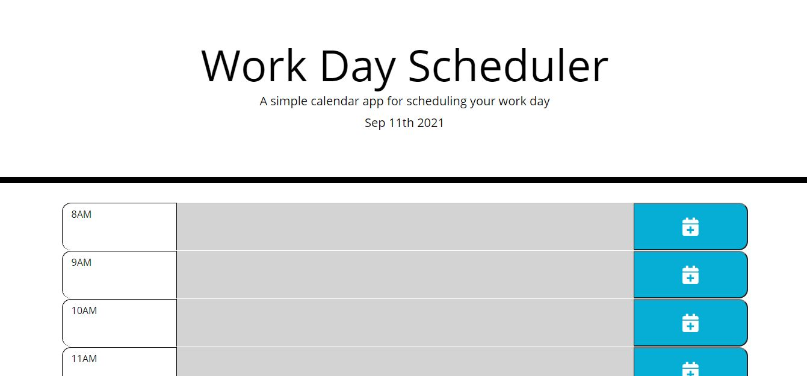
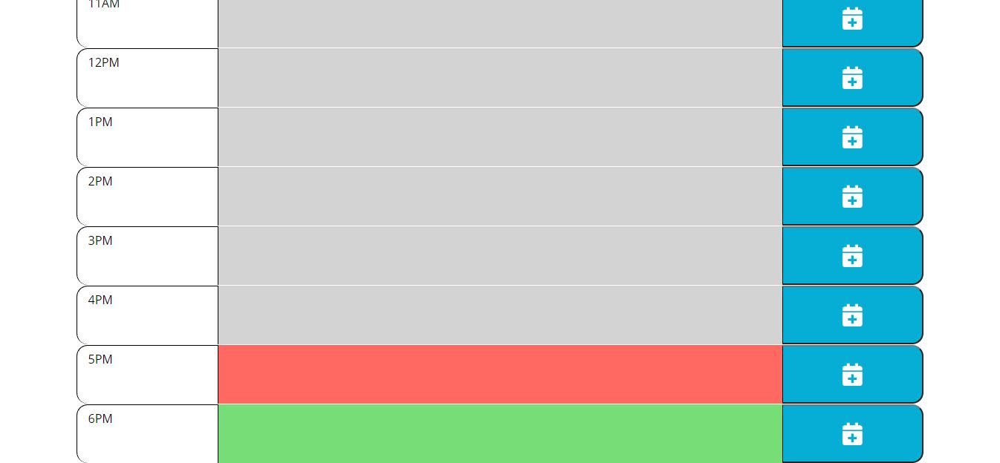

# day-calendar
Simple work day calendar application that reflects typical work hours in the form of hourly timeblocks, from 8:00AM to 6:00PM. The application timeblocks are color coded based on past, present, or future time and have the capability to take user input text, input into the timeblock, and save/retrieve from local storage.

## User Story
As an employee with a busy schedule, I want to add important events to a daily planner so that I can manage my time effectively.

## Acceptance Criteria
* Give I am using a daily planner to crate a schedule
* When I opoen the planner
* Then the current day is at the top of the calendar
* When I scroll down
* Then I am presented with timeblocks for standard business hours
* When I view the timebloks for that day
* Then each timeblock is color coded to indicate whether it is in the past, present, or future
* When I click into a timeblock
* Then I can enter an event
* When I clickt the save button for that timeblock
* Then the text for that event is saved in local storage
* When I refresht the page
* Then the saved events persist

## Application Preview

## Application Links
* Live App - https://cknig00q.github.io/day-calendar/
* Github Repo - https://github.com/cknig00q/day-calendar
